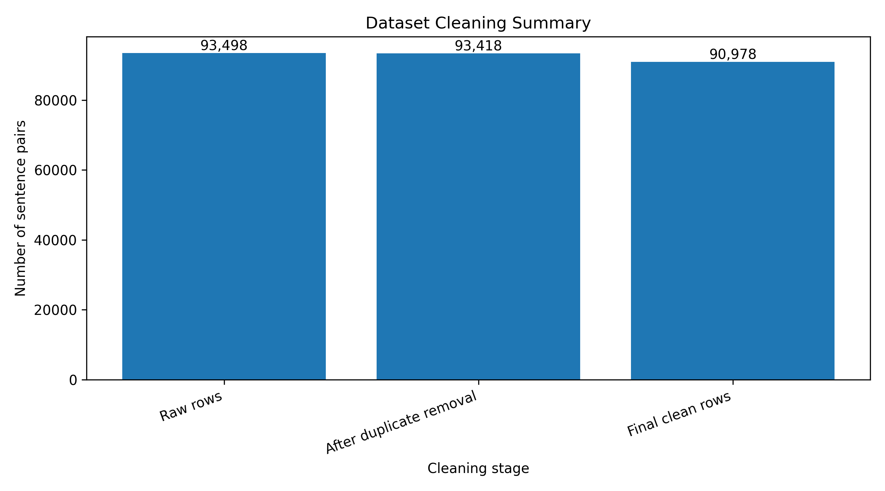
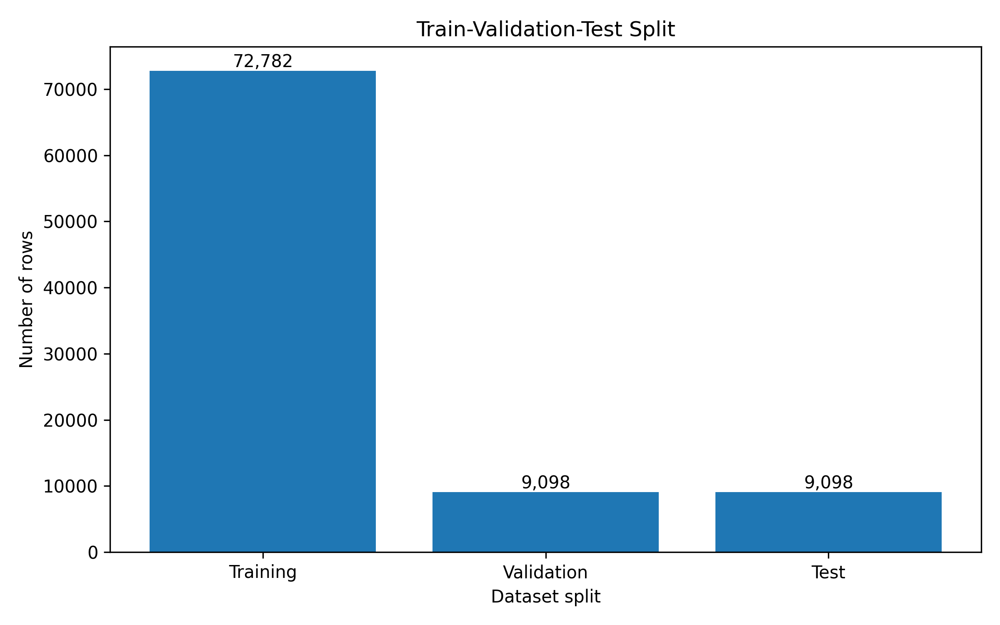
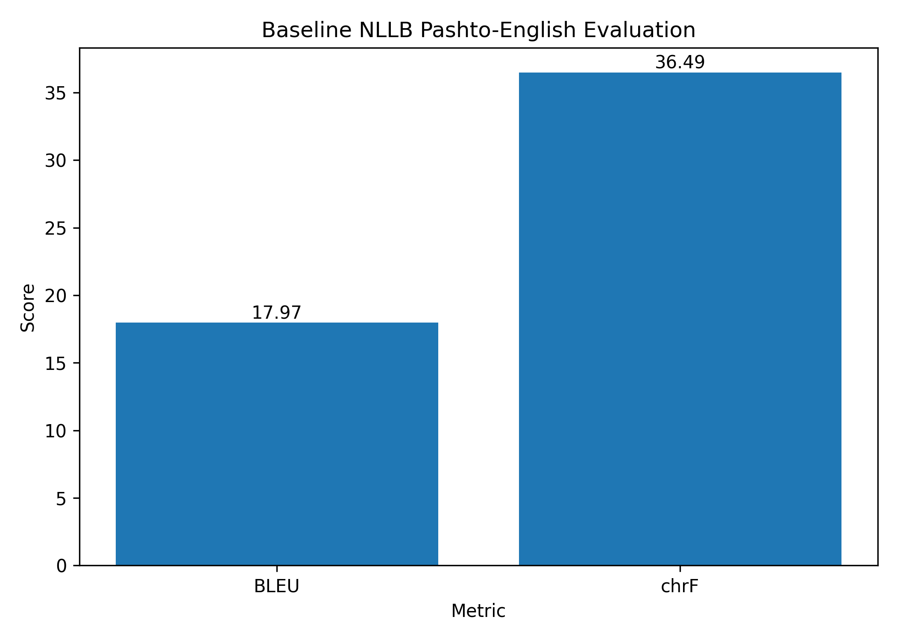
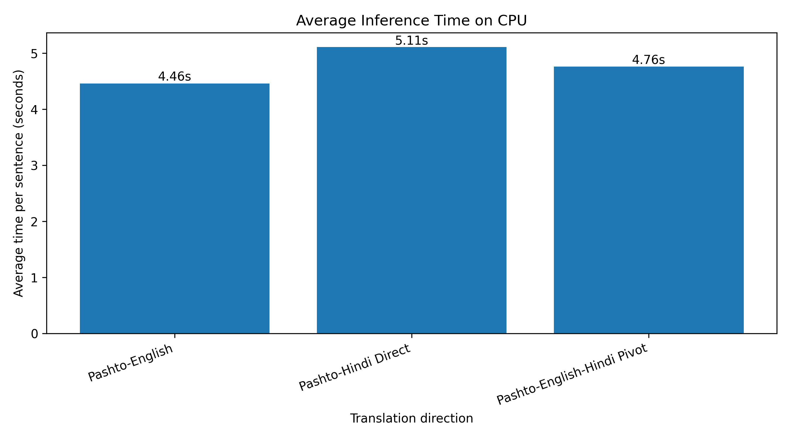
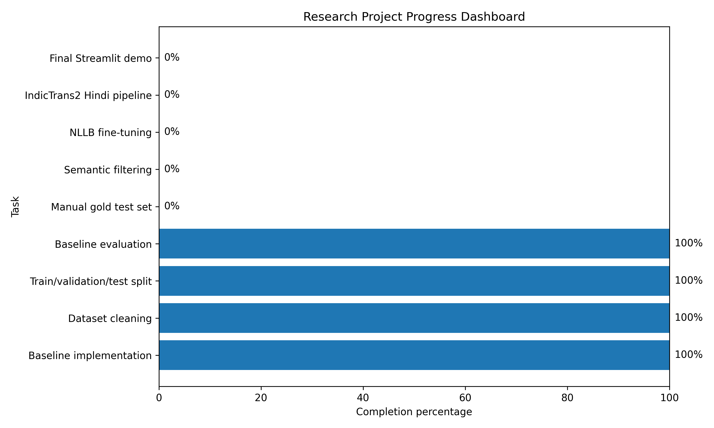
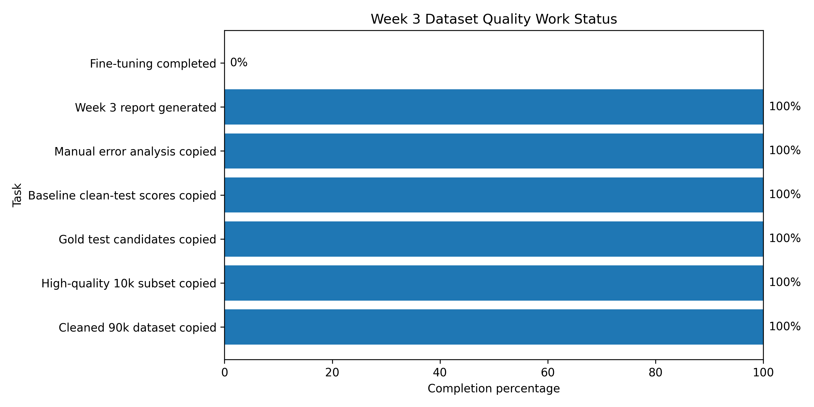

# Pashto to English and Hindi Neural Machine Translation

This repository contains my Carnot internship research work on low-resource Pashto Neural Machine Translation.

## Project Overview

This project focuses on building and improving a Neural Machine Translation system for:

1. Pashto to English translation
2. Direct Pashto to Hindi translation
3. Pashto to English to Hindi pivot-based translation

The baseline system uses the pretrained facebook/nllb-200-distilled-600M model.

## Current Work Completed

- Implemented baseline Pashto to English translation.
- Implemented direct Pashto to Hindi translation.
- Implemented Pashto to English to Hindi pivot translation.
- Used WMT20 Pashto-English data.
- Built dataset cleaning pipeline.
- Removed duplicate, noisy, URL, HTML, short, long, and mismatched sentence pairs.
- Created train-validation-test split.
- Evaluated baseline NLLB model using BLEU, chrF, and inference time.
- Started initial error analysis.

## Dataset Summary

| Stage | Rows |
|---|---:|
| Raw rows | 93,498 |
| After duplicate removal | 93,418 |
| Final clean rows | 90,978 |
| Removed noisy rows | 2,440 |

## Baseline Result

| Model | Direction | Samples | BLEU | chrF |
|---|---|---:|---:|---:|
| NLLB 600M | Pashto to English | 100 | 17.97 | 36.49 |

## Average Inference Time on CPU

| Direction | Time |
|---|---:|
| Pashto to English | 4.46 sec |
| Pashto to Hindi Direct | 5.11 sec |
| Pashto to English to Hindi Pivot | 4.76 sec |

## Future Work

- Create manually verified Pashto-English-Hindi test set.
- Add semantic similarity filtering using LaBSE, LASER, or multilingual sentence embeddings.
- Fine-tune NLLB on 10k and 50k cleaned Pashto-English pairs.
- Compare baseline and fine-tuned models.
- Add IndicTrans2 for better English-to-Hindi translation.
- Perform manual evaluation and error analysis.
- Build final Streamlit demo.

## Tech Stack

- Python
- PyTorch
- Hugging Face Transformers
- SentencePiece
- Pandas
- Scikit-learn
- SacreBLEU
- Streamlit
- PEFT / LoRA

## Author

Hrithik Sharma

## Week 2 Analysis Dashboard

The Week 2 research analysis includes dataset cleaning summary, train-validation-test split, baseline BLEU/chrF score, inference time analysis, and research progress dashboard.

### Analysis Figures

### Research Tables

- `outputs/tables/dataset_cleaning_summary.csv`
- `outputs/tables/train_val_test_split.csv`
- `outputs/tables/baseline_metrics.csv`
- `outputs/tables/inference_time.csv`
- `outputs/tables/model_comparison_plan.csv`
- `outputs/tables/manual_evaluation_template.csv`

## Week 3 Dataset Quality Integration

Week 3 work integrates cleaned dataset files, high-quality training subset, gold test candidates, clean-test baseline scores, and manual error analysis into the research repository.

### Week 3 Graphs

### Week 3 Report

- `docs/week3_dataset_quality_report.md`

### Week 3 Tables

- `outputs/tables/week3_dataset_files_summary.csv`
- `outputs/tables/week3_status_summary.csv`
- `outputs/tables/week3_high_quality_subset_summary.csv`
- `outputs/tables/week3_clean_test_baseline_scores.csv`
- `outputs/tables/week3_manual_error_analysis_clean_test.csv`
