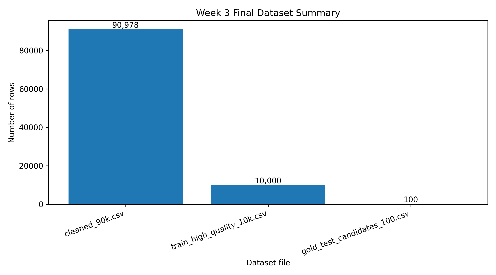
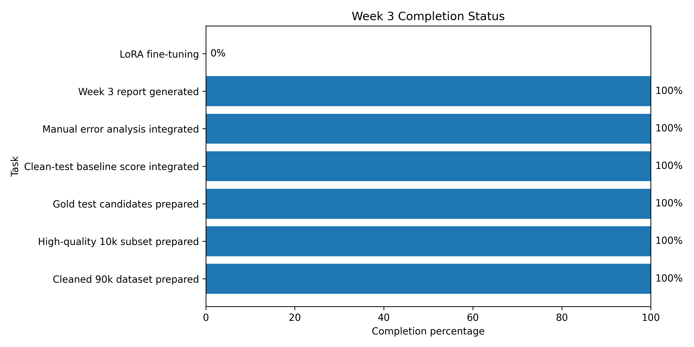
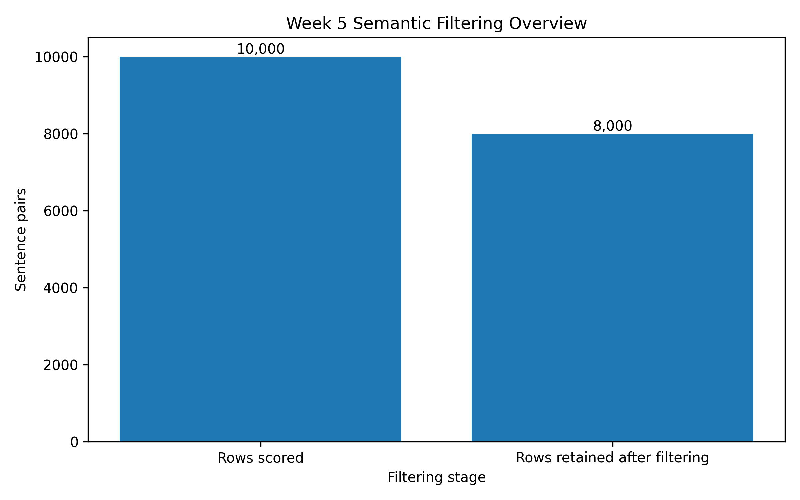
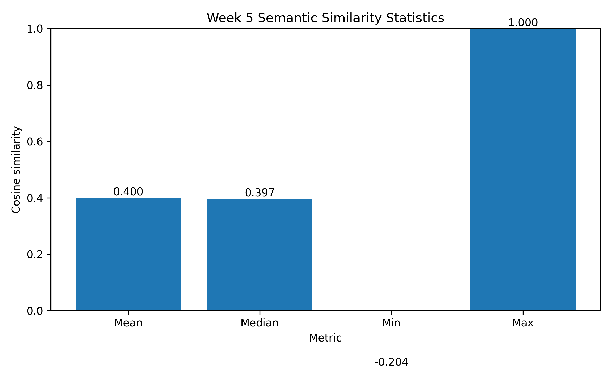
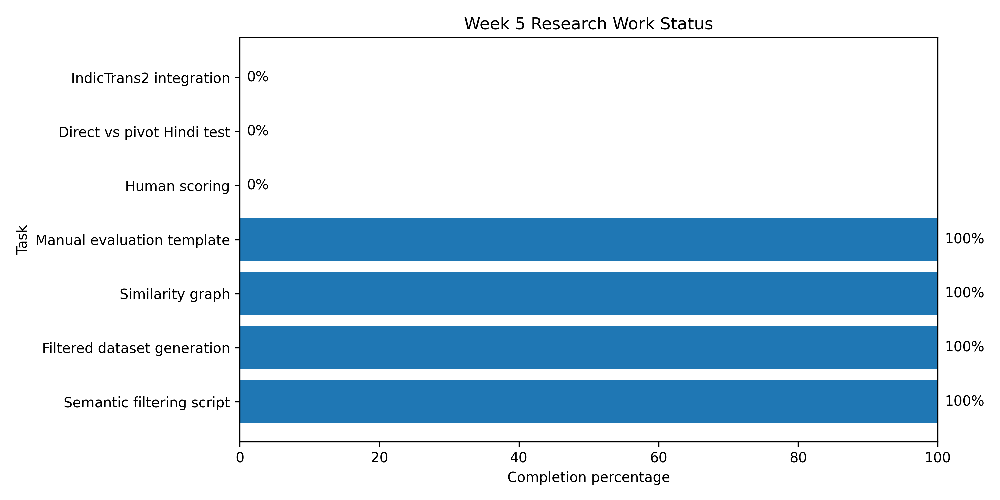
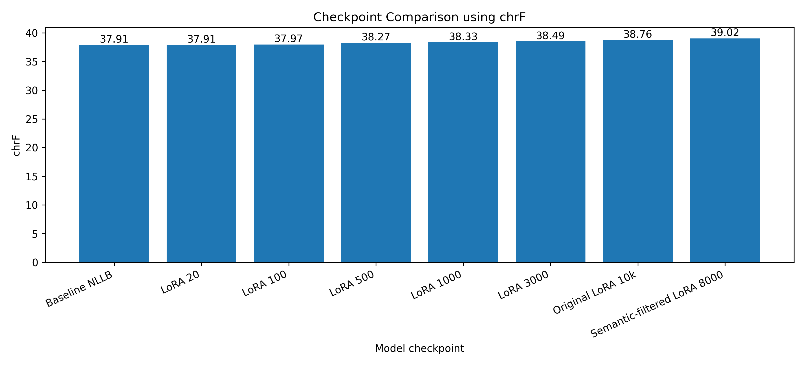
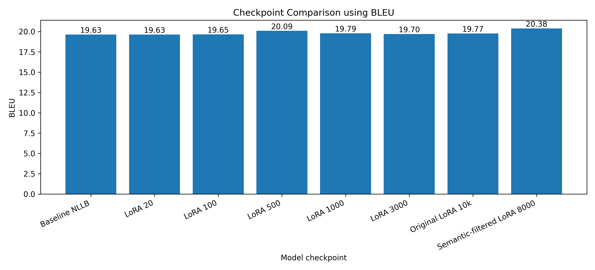

# Pashto to English and Hindi Neural Machine Translation

This repository contains my Carnot internship research work on low-resource Pashto Neural Machine Translation.

## Project Overview

This project focuses on building and improving a Neural Machine Translation system for:

1. Pashto to English translation
2. Direct Pashto to Hindi translation
3. Pashto to English to Hindi pivot-based translation

The baseline system uses the pretrained facebook/nllb-200-distilled-600M model.

## Current Work Completed

- Implemented baseline Pashto to English translation.
- Implemented direct Pashto to Hindi translation.
- Implemented Pashto to English to Hindi pivot translation.
- Used WMT20 Pashto-English data.
- Built dataset cleaning pipeline.
- Removed duplicate, noisy, URL, HTML, short, long, and mismatched sentence pairs.
- Created train-validation-test split.
- Evaluated baseline NLLB model using BLEU, chrF, and inference time.
- Started initial error analysis.

## Dataset Summary

| Stage | Rows |
|---|---:|
| Raw rows | 93,498 |
| After duplicate removal | 93,418 |
| Final clean rows | 90,978 |
| Removed noisy rows | 2,440 |

## Baseline Result

| Model | Direction | Samples | BLEU | chrF |
|---|---|---:|---:|---:|
| NLLB 600M | Pashto to English | 100 | 17.97 | 36.49 |

## Average Inference Time on CPU

| Direction | Time |
|---|---:|
| Pashto to English | 4.46 sec |
| Pashto to Hindi Direct | 5.11 sec |
| Pashto to English to Hindi Pivot | 4.76 sec |

## Future Work

- Create manually verified Pashto-English-Hindi test set.
- Add semantic similarity filtering using LaBSE, LASER, or multilingual sentence embeddings.
- Fine-tune NLLB on 10k and 50k cleaned Pashto-English pairs.
- Compare baseline and fine-tuned models.
- Add IndicTrans2 for better English-to-Hindi translation.
- Perform manual evaluation and error analysis.
- Build final Streamlit demo.

## Tech Stack

- Python
- PyTorch
- Hugging Face Transformers
- SentencePiece
- Pandas
- Scikit-learn
- SacreBLEU
- Streamlit
- PEFT / LoRA

## Author

Hrithik Sharma

## Week 2 Analysis Dashboard

The Week 2 research analysis includes dataset cleaning summary, train-validation-test split, baseline BLEU/chrF score, inference time analysis, and research progress dashboard.

### Analysis Figures

### Research Tables

- `outputs/tables/dataset_cleaning_summary.csv`
- `outputs/tables/train_val_test_split.csv`
- `outputs/tables/baseline_metrics.csv`
- `outputs/tables/inference_time.csv`
- `outputs/tables/model_comparison_plan.csv`
- `outputs/tables/manual_evaluation_template.csv`

## Week 3 Dataset Quality Integration

Week 3 work integrates cleaned dataset files, high-quality training subset, gold test candidates, clean-test baseline scores, and manual error analysis into the research repository.

### Week 3 Graphs

### Week 3 Report

- `docs/week3_dataset_quality_report.md`

### Week 3 Tables

- `outputs/tables/week3_dataset_files_summary.csv`
- `outputs/tables/week3_status_summary.csv`
- `outputs/tables/week3_high_quality_subset_summary.csv`
- `outputs/tables/week3_clean_test_baseline_scores.csv`
- `outputs/tables/week3_manual_error_analysis_clean_test.csv`

## Week 3 Final Dataset Quality and Evaluation

Week 3 completed dataset-quality preparation before fine-tuning. The work includes cleaned dataset integration, high-quality 10k subset preparation, gold test candidates, clean-test baseline score integration, and manual error analysis.

### Week 3 Final Graphs

### Week 3 Final Report

- `docs/week3_final_report.md`

### Week 3 Final Tables

- `outputs/tables/week3_final_dataset_summary.csv`
- `outputs/tables/week3_final_status.csv`
- `outputs/tables/week3_final_clean_test_scores.csv`
- `outputs/tables/week3_final_error_type_counts.csv`

## Week 4 LoRA Fine-Tuning and Evaluation

Week 4 focuses on LoRA-based fine-tuning of the `facebook/nllb-200-distilled-600M` model for Pashto-to-English Neural Machine Translation.

The fine-tuning pipeline uses Hugging Face Transformers, Datasets, and PEFT/LoRA. Initial local training trials were completed successfully, and the models were evaluated using BLEU and chrF scores. Early evaluations showed consistent chrF values around 38-39.

### Week 4 Work Completed

- Prepared LoRA fine-tuning plan.
- Created Hugging Face NLLB fine-tuning script.
- Created evaluation script for BLEU and chrF.
- Created automatic Week 4 report generation script.
- Fixed local training compatibility issues with the updated Transformers library.
- Completed initial LoRA training trials on local machine.
- Generated baseline vs fine-tuned comparison outputs.

### Week 4 Important Files

- `docs/week4_finetuning_plan.md`
- `docs/week4_colab_steps.md`
- `docs/week4_finetuning_report.md`
- `src/finetune_nllb_lora.py`
- `src/evaluate_week4_model.py`
- `src/generate_week4_report.py`

### Week 4 Results

- `outputs/tables/week4_model_comparison.csv`
- `outputs/figures/week4_bleu_comparison.png`
- `outputs/figures/week4_chrf_comparison.png`

### Week 4 Note

The full model checkpoints are not pushed to GitHub because they are large. Only scripts, reports, graphs, and evaluation outputs are included in the repository.

## Week 5 Research Work: Semantic Filtering and Manual Evaluation

Week 5 extends the Pashto Neural Machine Translation project beyond initial LoRA fine-tuning. The main focus is to improve dataset quality using semantic similarity filtering and prepare deeper evaluation through manual comparison of baseline and fine-tuned outputs.

### Week 5 Objective

The goal is to identify stronger Pashto-English sentence pairs for future fine-tuning and prepare a more reliable evaluation process. Instead of depending only on BLEU and chrF, this stage adds semantic filtering, graph-based analysis, and manual evaluation planning.

### Work Completed

- Added semantic similarity filtering using multilingual sentence embeddings.
- Generated semantic similarity scores for Pashto-English sentence pairs.
- Created semantically filtered training data.
- Generated semantic similarity distribution graph.
- Generated filtering overview graph.
- Generated similarity score statistics graph.
- Created manual evaluation template for baseline vs fine-tuned outputs.
- Added work-status graph for the next research stage.
- Prepared analysis plan for direct Pashto-to-Hindi vs pivot Pashto-English-Hindi translation.

### Week 5 Semantic Filtering Results

| Metric | Value |
|---|---:|
| Total sentence pairs scored | 10,000 |
| Filtered sentence pairs retained | 8,000 |
| Mean semantic similarity | 0.4001 |
| Median semantic similarity | 0.3967 |
| Minimum semantic similarity | -0.2038 |
| Maximum semantic similarity | 1.0000 |

### Week 5 Graph Analysis

#### Semantic Similarity Distribution

This graph shows how strongly Pashto-English sentence pairs are semantically aligned. Higher similarity values indicate better aligned sentence pairs, while low values indicate potentially noisy or weakly matched pairs.

#### Semantic Filtering Overview

This graph compares the number of sentence pairs scored and the number of sentence pairs retained after filtering. It helps show how the dataset was reduced from a larger pool into a cleaner subset.

#### Semantic Similarity Score Statistics

This graph summarizes the mean, median, minimum, and maximum semantic similarity scores. It provides a quick view of the quality range of the sentence-pair alignment.

#### Week 5 Work Status

This graph tracks completed and pending research tasks. Semantic filtering and evaluation-template preparation are completed, while human scoring, direct-vs-pivot Hindi evaluation, and IndicTrans2 integration remain future work.

### Week 5 Important Files

- `src/week5_semantic_filter.py`
- `src/week5_create_manual_eval_template.py`
- `src/week5_generate_report.py`
- `src/week5_work_status.py`
- `docs/week5_research_work.md`
- `outputs/tables/week5_semantic_filtering_summary.csv`
- `outputs/tables/week5_semantic_similarity_scores.csv`
- `outputs/tables/week5_top_bottom_similarity_examples.csv`
- `outputs/tables/week5_manual_evaluation_template.csv`
- `outputs/tables/week5_work_status.csv`
- `outputs/figures/week5_semantic_similarity_distribution.png`
- `outputs/figures/week5_filtering_overview.png`
- `outputs/figures/week5_similarity_score_stats.png`
- `outputs/figures/week5_work_status.png`

### Week 5 Interpretation

Semantic filtering improves the research pipeline by ranking sentence pairs according to cross-lingual similarity. This helps identify better training pairs for future LoRA fine-tuning. The filtered dataset can be used to test whether a smaller but cleaner training set performs better than a larger but noisier dataset.

Manual evaluation is also important because automatic metrics such as BLEU and chrF do not fully capture meaning preservation, missing words, named entity correctness, hallucination, or fluency. The manual evaluation template will help compare baseline and fine-tuned outputs in a more research-oriented way.

### Remaining Work

- Manually score selected baseline and fine-tuned translations.
- Train LoRA again using semantically filtered data.
- Compare baseline, original LoRA, and semantic-filtered LoRA checkpoints.
- Compare direct Pashto-to-Hindi translation with pivot Pashto-English-Hindi translation.
- Explore IndicTrans2 for the English-to-Hindi stage.

## Remaining Research Work Results

The remaining research pipeline has now been extended beyond initial LoRA fine-tuning and semantic filtering.

### Completed Remaining Work

- Created manual scoring template for selected baseline and fine-tuned translations.
- Trained LoRA again using semantically filtered Pashto-English data.
- Evaluated the semantic-filtered LoRA checkpoint.
- Generated checkpoint comparison between baseline, original LoRA, and semantic-filtered LoRA outputs.
- Created direct Pashto-to-Hindi vs pivot Pashto-English-Hindi comparison file.
- Added IndicTrans2 exploration note for the English-to-Hindi stage.

### Important Remaining-Work Files

- `outputs/tables/remaining_manual_scoring_template.csv`
- `outputs/tables/remaining_semantic_lora_8000_predictions.csv`
- `outputs/tables/remaining_checkpoint_comparison.csv`
- `outputs/tables/remaining_direct_vs_pivot_hindi.csv`
- `outputs/figures/remaining_chrf_checkpoint_comparison.png`
- `outputs/figures/remaining_bleu_checkpoint_comparison.png`
- `docs/remaining_checkpoint_comparison.md`
- `docs/remaining_indictrans2_exploration.md`

### Remaining-Work Graphs

### Interpretation

The semantic-filtered LoRA experiment checks whether cleaner sentence-pair selection improves translation quality compared with the baseline and earlier LoRA checkpoints.

The direct-vs-pivot Hindi comparison file is prepared for manual review. This will help decide whether direct Pashto-to-Hindi translation or Pashto-to-English-to-Hindi pivot translation gives more natural and meaning-preserving Hindi outputs.

IndicTrans2 remains the next planned improvement for the English-to-Hindi stage.

