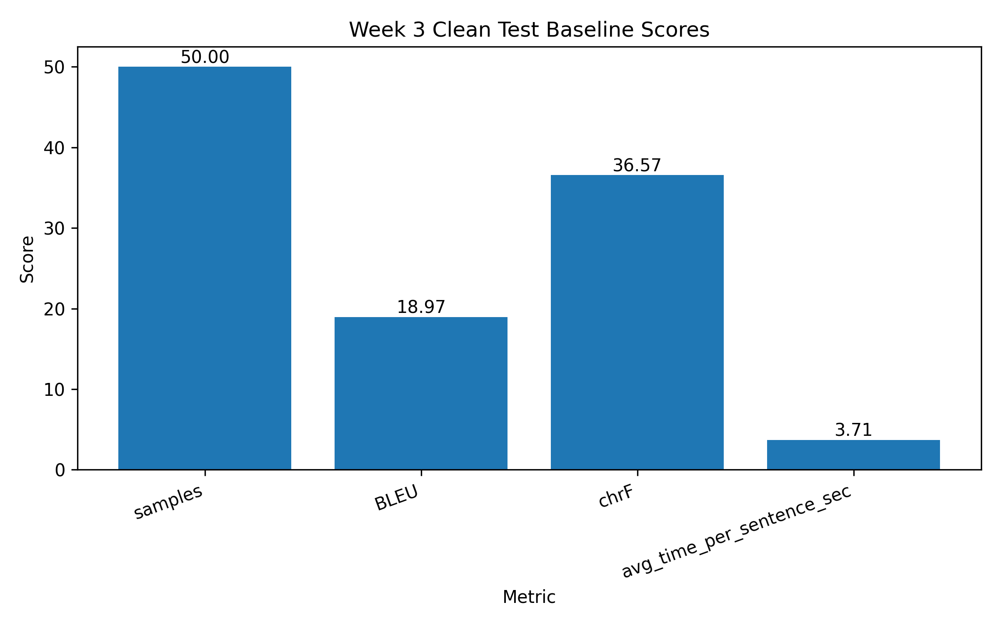

# Week 3 Dataset Quality Integration Report

## Objective

The objective of Week 3 is to organize and integrate the cleaned Pashto-English dataset, high-quality subset, clean test set, baseline clean-test scores, and manual error analysis files into the GitHub research repository.

This week does not claim fine-tuning results. It prepares the dataset-quality foundation required before fine-tuning.

## Dataset Files Integrated

| Dataset | File | Rows | Columns |
|---|---|---:|---:|
| Cleaned dataset | `data/cleaned_90k.csv` | 90978 | 3 |
| High-quality training subset | `data/train_high_quality_10k.csv` | 10000 | 3 |
| Gold test candidates | `data/gold_test_candidates_100.csv` | 100 | 5 |

## Week 3 Work Status

## Clean Test Baseline Scores

The clean-test baseline score file was copied from the previous project workspace and added to the current repository for Week 3 analysis.

## Manual Error Analysis

Manual error analysis was integrated and visualized from the clean-test evaluation file.

## Files Generated

- `data/gold_test_candidates_100.csv`
- `outputs/tables/week3_dataset_files_summary.csv`
- `outputs/tables/week3_status_summary.csv`
- `outputs/tables/week3_high_quality_subset_summary.csv`
- `outputs/tables/week3_clean_test_baseline_scores.csv`
- `outputs/tables/week3_manual_error_analysis_clean_test.csv`
- `outputs/figures/week3_dataset_files_summary.png`
- `outputs/figures/week3_status_summary.png`
- `docs/week3_dataset_quality_report.md`

## Next Step

The next step is to use the high-quality 10k subset for NLLB fine-tuning. After fine-tuning, the model will be compared with the baseline using BLEU, chrF, inference time, and manual evaluation.
