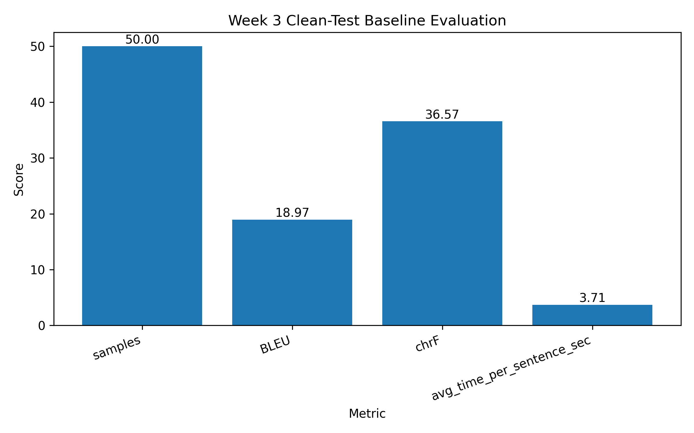
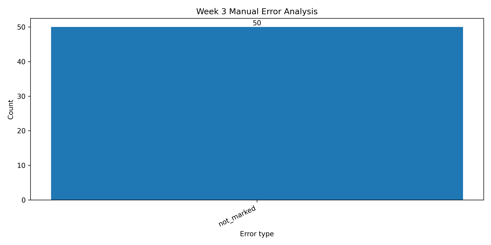

# Week 3 Final Dataset Quality and Evaluation Report

## Objective

The goal of Week 3 was to complete dataset-quality preparation before fine-tuning. This stage does not include LoRA fine-tuning. It focuses on cleaned data integration, high-quality subset preparation, gold test candidate preparation, clean-test baseline score integration, and manual error analysis.

## Final Week 3 Dataset Summary

| File | Purpose | Rows | Columns |
|---|---|---:|---:|
| `cleaned_90k.csv` | Final cleaned Pashto-English dataset | 90978 | 3 |
| `train_high_quality_10k.csv` | High-quality subset prepared for fine-tuning | 10000 | 3 |
| `gold_test_candidates_100.csv` | Clean test/gold candidate set for evaluation | 100 | 5 |

## Week 3 Completion Status

## Clean-Test Baseline Evaluation

The clean-test baseline evaluation file was integrated and visualized. This provides the evaluation foundation before fine-tuning.

## Manual Error Analysis

Manual error analysis was integrated to understand common translation issues before fine-tuning.

## Week 3 Conclusion

Week 3 completed the dataset-quality foundation required for fine-tuning. The cleaned dataset, high-quality 10k subset, gold test candidates, clean-test baseline scores, and manual error analysis are now organized in the research repository. The next stage is Week 4 LoRA fine-tuning of NLLB using the high-quality 10k subset.

## Next Step

Proceed to Week 4: LoRA fine-tuning of `facebook/nllb-200-distilled-600M` on `data/train_high_quality_10k.csv` using Google Colab GPU.
