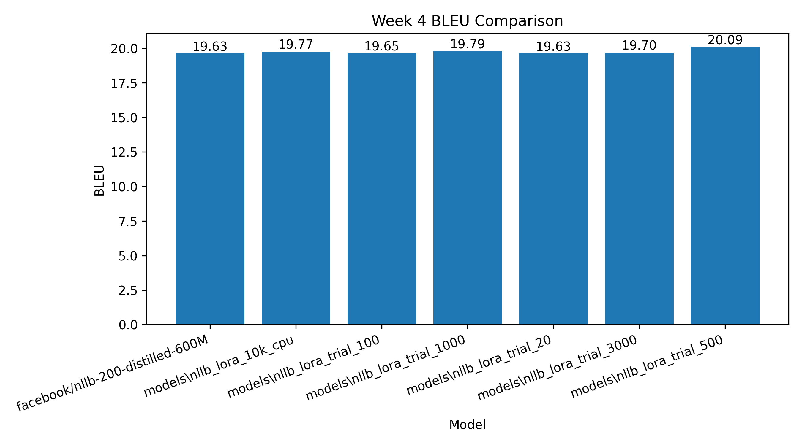
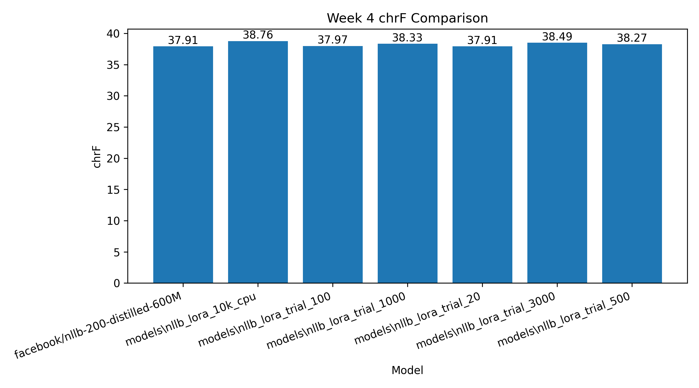

# Week 4 Fine-Tuning Evaluation Report

## Objective

Week 4 compares baseline NLLB and LoRA fine-tuned NLLB on the gold test candidate set.

## Model Comparison

| Model | Samples | BLEU | chrF |
|---|---:|---:|---:|
| facebook/nllb-200-distilled-600M | 100 | 19.63 | 37.91 |
| models\nllb_lora_10k_cpu | 100 | 19.77 | 38.76 |
| models\nllb_lora_trial_100 | 100 | 19.65 | 37.97 |
| models\nllb_lora_trial_1000 | 100 | 19.79 | 38.33 |
| models\nllb_lora_trial_20 | 100 | 19.63 | 37.91 |
| models\nllb_lora_trial_3000 | 100 | 19.7 | 38.49 |
| models\nllb_lora_trial_500 | 100 | 20.09 | 38.27 |

## Graphs

## Interpretation

The comparison shows whether LoRA fine-tuning improves the baseline model. If scores improve, it indicates better adaptation to the Pashto-English dataset. If improvement is small, the result still gives research insight about low-resource data quality and training size limitations.
