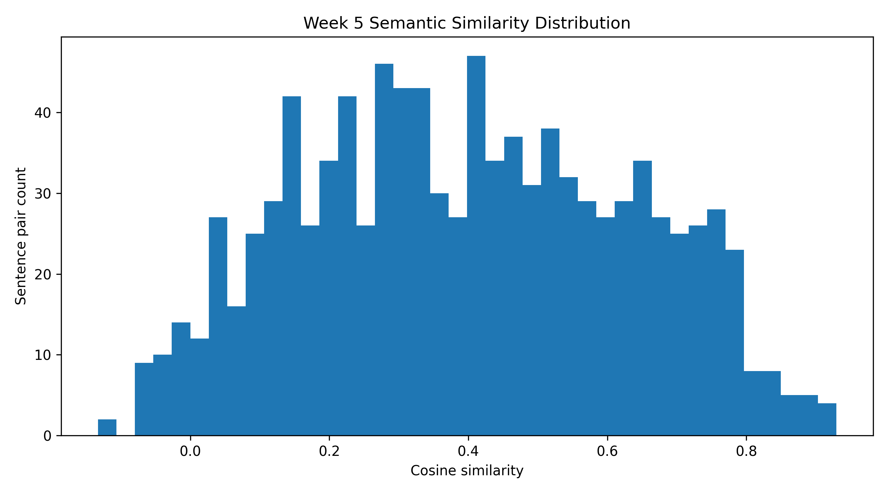

# Week 5 Research Work: Semantic Filtering and Manual Evaluation

## Objective

This research stage focuses on improving the Pashto Neural Machine Translation pipeline beyond initial LoRA fine-tuning. The main tasks are semantic similarity filtering, manual evaluation, baseline versus fine-tuned error analysis, and Hindi pivot-translation planning.

## Work Added

1. Semantic filtering script using multilingual sentence embeddings.
2. Filtered Pashto-English training dataset generation.
3. Semantic similarity score table.
4. Semantic similarity distribution graph.
5. Manual evaluation template for baseline versus fine-tuned outputs.
6. Research plan for direct Hindi and pivot Hindi comparison.

## Semantic Filtering Summary

| Total Rows Scored | Filtered Rows Saved | Mean Similarity | Median Similarity | Min Similarity | Max Similarity |
|---:|---:|---:|---:|---:|---:|
| 1000 | 800 | 0.3976 | 0.3957 | -0.1328 | 0.9295 |

## Manual Evaluation Plan

Manual evaluation will compare baseline and fine-tuned translations using meaning preservation, fluency, completeness, named entity correctness, hallucination detection, and missing-word analysis.

## Hindi Translation Extension

The next translation extension will compare direct Pashto-to-Hindi translation with pivot-based Pashto-to-English-to-Hindi translation. IndicTrans2 can be explored for the English-to-Hindi stage to improve Hindi fluency and naturalness.

## Expected Impact

Semantic filtering is expected to remove weakly aligned sentence pairs and improve the quality of future LoRA fine-tuning. Manual evaluation will provide deeper insight into whether fine-tuned outputs are semantically better than baseline outputs.
